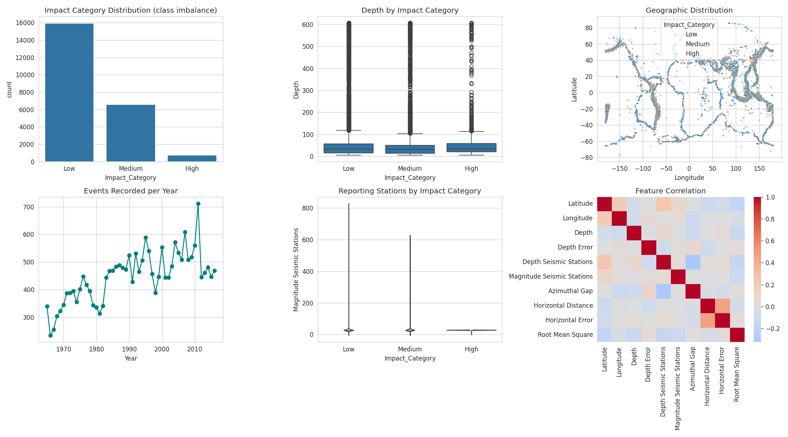

<div align="center">

# 🌍 Earthquake Impact & Alert Classification

### An End-to-End Machine Learning Capstone — Real USGS Data, 9 Models Compared, Live Dashboard

[](https://www.python.org/)
[](https://scikit-learn.org/)
[](https://lightgbm.readthedocs.io/)
[](#license)

**[📊 Results](#-model-results)** · **[⚡ Quickstart](#-quickstart)** · **[📁 Structure](#-repository-structure)**



</div>

---

## 📌 Overview

Seismic networks log hundreds of thousands of events. Before a fully reviewed magnitude
is even available, this project gives disaster-response teams and insurers a **fast triage
signal** — classifying an earthquake as **🟢 Low / 🟡 Medium / 🔴 High** impact using only
the metadata a monitoring station records independently (depth, location, station coverage,
signal quality).

> ⚠️ **This is an event-impact classifier, not an earthquake-prediction system.** It does not
> predict *when* or *where* an earthquake will strike.

| | |
|---|---|
| 🎯 **Task** | Multiclass classification (Low / Medium / High) |
| 🗃️ **Dataset** | [USGS Significant Earthquakes, 1965–2016](https://github.com/madeyoga/Significant-Earthquakes-1965-2016) — 23,412 real records |
| 🏆 **Best Model** | LightGBM (tuned) — F1-macro **0.463** on held-out test set |
| 🖥️ **Dashboard** | Interactive Streamlit app — live prediction + model comparison + explainability |
| 🔒 **No leakage** | Magnitude drives the label, so it's excluded from features entirely |

---

## 🧭 Pipeline

```
📥 Collect  →  🧹 Clean  →  📊 EDA  →  🛠️ Feature Engineer  →  ✂️ Split
     ↓
🤖 Train 9 Models  →  🎯 Tune Top 2  →  ⚖️ SMOTE Experiment  →  🏆 Best Model
     ↓
📈 Evaluate  →  🖥️ Dashboard  →  📦 Publish
```

<details>
<summary><b>Click to expand: what happens at each stage</b></summary>

| Stage | What's done |
|---|---|
| **Collect** | 23,412 real USGS earthquake records pulled directly (well above the 10k minimum) |
| **Clean** | Duplicates removed, dates parsed, invalid depths dropped, outliers capped at 1st/99th pct |
| **EDA** | 6 charts — class balance, depth/impact, geographic fault-line clustering, correlations, yearly trend, station coverage |
| **Feature Engineer** | Cyclical month/hour encoding, depth bands, station/gap ratio, one-hot categoricals — **magnitude excluded to prevent leakage** |
| **Split** | Stratified 80/20, scaler fit on train only |
| **Train** | 9 algorithms: Logistic Regression, Decision Tree, Random Forest, XGBoost, LightGBM, SVM, KNN, Naive Bayes, Neural Net |
| **Tune** | `RandomizedSearchCV` (20 iters, 3-fold CV) on the top 2 models |
| **SMOTE** | Tested oversampling the minority "High" class — class-weighting won out (see [Results](#-model-results)) |
| **Evaluate** | F1-macro, precision/recall, confusion matrix, feature importance |
| **Dashboard** | Streamlit app with live prediction, model leaderboard, explainability |

</details>

---

## 📊 Model Results

9 algorithms compared on **F1-macro** (chosen over accuracy — with a 3% minority class,
a model that always predicts "Low" scores 68.6% accuracy while being useless):

| Rank | Model | Accuracy | F1-macro | CV F1-macro |
|:---:|---|:---:|:---:|:---:|
| 🥇 | **LightGBM (tuned)** | 0.624 | **0.463** | 0.472 |
| 🥈 | XGBoost (tuned) | 0.721 | 0.448 | 0.437 |
| 🥉 | SVM (RBF) | 0.544 | 0.421 | 0.419 |
| 4 | Decision Tree | 0.618 | 0.405 | 0.411 |
| 5 | Neural Network (MLP) | 0.715 | 0.400 | 0.386 |
| 6 | Random Forest | 0.716 | 0.392 | 0.386 |
| 7 | Logistic Regression | 0.492 | 0.381 | 0.384 |
| 8 | K-Nearest Neighbours | 0.697 | 0.373 | 0.362 |
| 9 | Naive Bayes | 0.115 | 0.102 | 0.085 |

<details>
<summary><b>⚖️ SMOTE experiment (click to expand)</b></summary>

Tested SMOTE oversampling on the minority "High" class as an alternative to `class_weight="balanced"`:

| Approach | Test F1-macro | High-class recall |
|---|:---:|:---:|
| **Class-weighting (final)** | **0.463** | **14%** |
| SMOTE | 0.457 | 6% |

Class-weighting won — SMOTE's synthetic "High" samples get interpolated in a feature
space where High genuinely overlaps Low/Medium, so it doesn't help as much as it does
on cleaner-separated imbalanced problems.

</details>

**Confusion Matrix — LightGBM (tuned):**

| Actual \ Predicted | 🔴 High | 🟢 Low | 🟡 Medium |
|---|:---:|:---:|:---:|
| 🔴 **High** | 20 | 33 | 94 |
| 🟢 **Low** | 78 | 2,350 | 759 |
| 🟡 **Medium** | 84 | 516 | 712 |

**Top features:** Longitude → Depth → Absolute Latitude → Latitude → RMS residual
— consistent with seismology (shallow events in well-monitored tectonic belts are both
more damaging and better recorded).

---

## ⚡ Quickstart

```bash
git clone https://github.com/Bhargav10261/Earthquake-Impact-Alert-Classification-ML-Capstone-Google-Colab-.git
cd Earthquake-Impact-Alert-Classification-ML-Capstone-Google-Colab-
pip install -r requirements.txt
streamlit run dashboard/app.py
```

Or run the whole pipeline from scratch in **Google Colab**:
👉 open `earthquake_capstone_colab.ipynb` → `Runtime → Run all`

---

## 📁 Repository Structure

```
├── data/                     # raw + cleaned CSVs, train/test splits
├── src/                      # step-by-step pipeline scripts
│   ├── 01_clean_data.py
│   ├── 02_eda.py
│   ├── 03_features_split.py
│   ├── 04_train_models.py
│   ├── 05_tune_top2.py
│   └── 06_eval_visuals.py
├── models/                   # saved scaler, encoder, best model (.joblib)
├── reports/
│   ├── figures/               # all EDA + evaluation charts
│   ├── model_comparison.csv
│   ├── confusion_matrix.csv
│   └── feature_importance.csv
├── dashboard/app.py           # Streamlit prediction dashboard
├── earthquake_capstone_colab.ipynb  # single-file Colab notebook
├── requirements.txt
└── README.md
```

---

## ⚠️ Limitations & Next Steps

- **High-impact recall is low (~14%)** — only 737 historical examples, and by design
  the model can't see magnitude. Use as a **triage aid, not a sole decision-maker**.
- Real deployment would benefit from live waveform features (amplitude, P-wave arrival
  spread) not available in this historical export.
- **Next steps:** ensembling LightGBM + XGBoost, re-validating on post-2016 USGS data
  to check for concept drift as monitoring networks have expanded.

---

## 🛠️ Tech Stack


## 📄 License

Data is USGS public-domain earthquake catalog information. Code released under the MIT License.


<div align="center">

⭐ **If this project helped you, consider giving it a star!** ⭐

</div>
